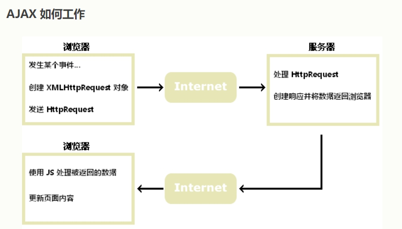

## 什么是Ajax
- AJAX = Asynchronous JavaScript And XML.

*Ajax 是一个令人误导的名称。Ajax 应用程序可能使用 XML 来传输数据，但将数据作为纯文本或 JSON 文本传输也同样常见。*
- AJAX 仅仅组合了：

1、浏览器内建的 XMLHttpRequest 对象（从 web 服务器请求数据）

2、JavaScript 和 HTML DOM（显示或使用数据）

- Ajax 允许通过与场景后面的 Web 服务器交换数据来异步更新网页。这意味着可以更新网页的部分，而不需要重新加载整个页面。

## Ajax工作原理

- 网页中发生一个事件（页面加载、按钮点击）
- 由 JavaScript 创建 XMLHttpRequest 对象
- XMLHttpRequest 对象向 web 服务器发送请求
- 服务器处理该请求
- 服务器将响应发送回网页
- 由 JavaScript 读取响应
- 由 JavaScript 执行正确的动作（比如更新页面）操作DOM

## onreadystatechange、readyState
>onreadystatechange在readyState改变后会调用
**readyState的状态码**
- 0：请求未初始化
- 1：服务器连接已建立
- 2：请求已收到
- 3：正在处理请求
- 4：请求已完成且响应已就绪

## XMLHttpRequest 对象方法(常用)
- open(method, url, async, user, psw) ：规定请求
- send()：将请求发送到服务器。若里面有string用于post请求
- abort()：取消当前请求
- getAllResponseHeaders():返回头部信息
- getResponseHeader():返回特定的头部信息

## 封装
```javascript
function ajax(options) {
  options.type = (options.type || 'GET').toUpperCase()
  options.data = options.data || {}
  options.contentType = (options.contentType || 'json')
  const xhr = new XMLHttpRequest()
  xhr.onreadystatechange = () => {
    if (xhr.readyState == 4) {
      let status = xhr.status
      if (status >= 200 && status < 300) {
        options.success && options.success(xhr.responseText, xhr.response)
      } else {
        options.fail && options.fail(status)
      }
    }
  }
  if (options.type == "GET") {
    xhr.open('GET', options.url + "?" + options.data, true)
    xhr.send(null)
  }
  if (options.type == "POST") {
    xhr.open('POST', options.url, true)
    xhr.send(options.data)
  }
}

ajax({
  type: 'post',
  contentType: 'json',
  data: {},
  url: 'https://xxxx',
  success: function (text, xml) {//请求成功后的回调函数
    console.log(text)
  },
  fail: function (status) {////请求失败后的回调函数
    console.log(status)
  }
})  
```