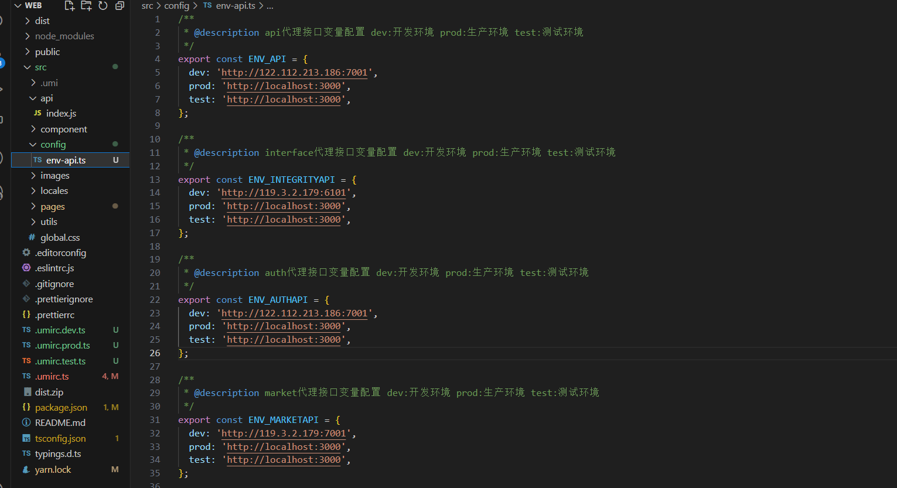
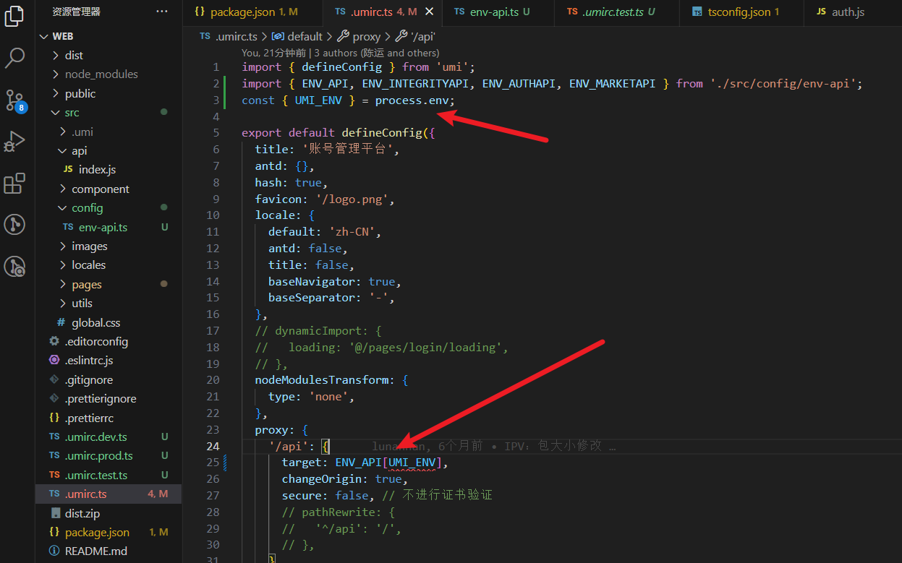

# 使用cross-env进行umi环境变量配置

### 1. 安装cross-env

```bash
npm install cross-env --save-dev

```

### 2. 配置package.json

```json
//这里面的字段是在编译中使用的，例如：在.umirc.ts中使用process.env.UMI_ENV就可以获取到dev、prod、test
{
  "scripts": {
    "start": "cross-env UMI_ENV=dev umi dev --port=8088 ",
    "start:prod": "cross-env UMI_ENV=prod umi dev --port=8088 ",
    "start:test": "cross-env UMI_ENV=test umi dev --port=8088 ",
    "build": "cross-env umi build UMI_ENV=dev",
    "build:prod": "cross-env umi build UMI_ENV=prod",
    "build:test": "cross-env umi build UMI_ENV=test",
  }
}

```

### 3.创建多个环境变量文件

在根目录下创建多个环境变量文件，如下：

```bash
.umirc.dev.ts
.umirc.prod.ts
.umirc.test.ts
.umirc.ts
```
在对应的环境变量文件中配置环境变量，如下：
在.umirc.dev.ts中:

```typescript
//这里面的字段是在编译后全局使用的
export default {
  define: {
    'process.env.UMI_ENV': 'dev', 
    'tempKey'："tempValue" //这里面的字段是可以在全局使用的,如：console.log(tempKey)就可以打印出tempValue
  },
};
```
### 4.最后在.umirc.ts使用环境变量，如下：

```typescript
const { UMI_ENV } = process.env; //这个UMI_ENV就是我们在package.json中配置的环境变量,如：dev、prod、test
```

### 示例：

1. 我们封装target-api.ts文件进行代理管理。



2. 在.umirc.ts中配置代理
   

